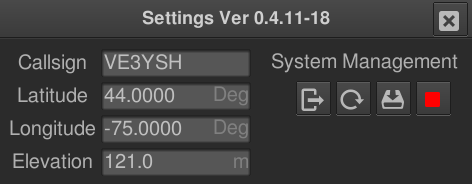
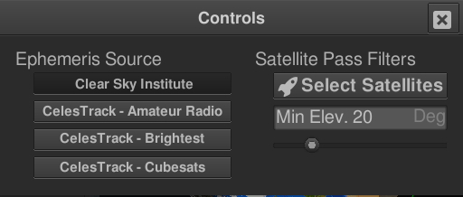

# HamChrono

## See Also:
1. My [Debian Repository](Repository.md) for information on installing.

1. How to [auto start](AutoStart.md) on a Pi.

This will give you a brief introduction to HamChrono and how to use it.
The primary development target for the program is a Raspberry Pi with
the official 7-inch touch screen running without the desktop software.
In this case the program runs directly on the screen frame buffer and
is controlled by screen touch gestures. When run on a system with the
desktop software installed and running it can be controlled by mouse
gestures, left button clicks for presses, and left button drags for
finger drags.

The overall screen looks the same in both environments, except the desktop
version has a window frame.

## Callsign Button

Your callsign is displayed as the label of a button which, when pressed,
brings up the configurtion dialog.

The Settings Dialog allows you to set your Callsign, position and elevation.
At the moment this requires a keyboard and mouse even if you are using the 
touch screen interface. There is another way to set this information if
you don't want to connect a keyboard. Simply ssh into the Raspberry Pi
and start the program once setting this information on the command line:

`hamchrono -cs VE3YSH -lat 44.0 -lon -75.0 -el 121.0`

The System Management area has buttons to:

1. Exit the program.

1. Reboot the computer.

1. Upgrade the software using `sudo apt update; sudo apt --assume-yes upgrade`.

1. Shutdown the computer.

These are only inteded for use on systems where the program runs directly on
the frame buffer and require that the account running the program has NOPASSWORD
`sudu` privileges. Each action requires a Yes answer in a confirming dialog.

## GMT/UTC Time Display

Below the callsign button is the GMT/UTC time display. This also displays
the CPU temperature (Zone 3 on x86 systems) and CPU usage. When using the
official 7-inch Raspberry Pi display, dragging a finger left and right on
this dispplay will dim and brighten the display backlight.

## Local Time Display

Below the GMT/UTC time display is the local time display. This displays the
local time according to the system configuration. Not much else to say about
this.

## Distant Station Display

Finally, down the remainder of the left hand side is the distant station
display. This is a tab display with a "rocket" and a "location" icon on
the two tabs. These tabs hold the satellite prediction display, and the
terrestrial station data respectively. At the moment only the satellite
display is implemented. Pressing the tab icon will select the corresponding
tab.

### Satelite Prediction Data

For each of five satellites there is displayed the tracking icon, the
satellite short name (derived from the ephemeris data) and the pass
prediction data. 

## Supporting Data

Along the top, between the Callsign Button and the Switch Matrix is the
supporting data display. At present there is only NASA Solar Imageery.
Dragging a finger either up or down on the image will select the next or
previous image in the list. Pressing a finger on the image will call up
a larger display image. New images are loaded aproximately every hour.

## Switch Matrix

The switch matrix at the top right controls most of the action of the 
program. Not all the switches have a function at the moment, and the
icon may change as they aquire functions.

### Satellite/Terestrial Buttons

The buttons with the "rocket" and "location" icons, similar to the tabs
on the Distant Station Display select between satellite and terrestrial
station data. They are ganged toggle buttons. Both may be off, but only
one may be on at at time.

#### Satellite

When on satellite orbital position display is active, and automatic pass
tracking display is enabled. When one or more satelittes are passing in
view the display will automatically shift to azimuthal display, and the
right side will be replace by an azimuthe/elevation display of satellites
in view.

#### Terestrial

Not yet implemented. 

#### Celestial Objects

This toggle button controls the display of the position of celestial objects:
the Sun and the Moon.

#### Mercater/Azimuth Projection

This toggle button controls the displayed projection of the map: Mercator or 
Azmuthal; when not configured automatically for pass prediction display.

#### Screen Shot

The Screen Shot button will cause the program to save an image of the current
display to the current working directory `screenshot.bmp`.

#### More Controls

This button will bring up a dialog with more, less frequently used controls;
These include Ephemeis Source selection and Satellite Pass Filters.

##### Ephemeris Source

A set of radio buttons allow for the selection of one from a number of
sources.

1. Clear Sky Institute: load ephemeris from the original Ham Clock source.

1. CelesTrack Amateur Radio: Load ephemeris from CelesTrack amateur radio list.

1. CelesTrack Brightest: Load ephemeris from CelesTrack 100 (or so) brightest objects list.

1. CelesTrack Cubesats: Load Ephemeris from CelesTrack Cubesat list.

##### Satellite Pass Filters

There are two pass filters: Selected Satellites, and Minimum Pass Elevation. 

1. Minimum Pass Elevation will screen satellite passes which will not reach the specified
minimum elevation during that pass. Satellites will be considered for each subsequent pass.
The value is set in increments of 5 degrees using the slider, and displayed in the text
box.

1. The Selected Satellite List will restrict orbital and pass prediction to satellites on
the list. Satellites with a check mark are on the list, others are not. If the list is
empty **all satellites are on the list**. Minimum Pass Elevation filtering is applied
after the Selected Satellite filtering. Use this feature when you are truly only interested
in some of the satellites contained in an ephemeris set. Since the Clear Sky Institute
and CelesTrack use slightly different naming conventions using this feature and switching
between ephemeris sets from these two sources may give unexpected results.

## Data Caching

Resources downloaded from the Internet: NASA Solar Imagery; and Ephemeris Sets; are now 
cached in the users' home directory (under `.hamchrono/images` and `.hamchrono/ephmeris`
respectively). The cache strategy varries slightly by data type.

1. Solar Imagery in the cache is always loaded at start up. If an image is older than
half the normal refresh period the program will try to fetch the current image.

1. Ephemeris Sets in the cache are only loaded if they are less than half the normal
replacement age. If they ae older than this the program will try to fetch the current
ephemeris set.

This caching strategy is intended to provide faster program startup and reduce unnecessar
internet traffic while not negatively affecting program operation.
